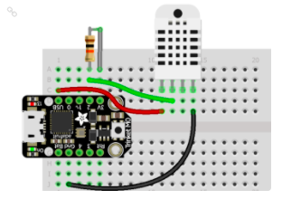

# Experiments with Adafruit Feather Nrf52840 Express

Really don't know where to put details of specfic projects for the board, so stuffing it here.  

## General Experiments

As part of the overall CP-BLE-Experiments, I tried a number of examples related to BLE.  These all use a custom BT Uart Packet to work with the "BluefruitConnect" IOS application. (think there is an Android one as well). 

Files:
- minimum.py - advertise only
- button_press.py - print to serial when button is pressed
- combo.py - a mash up of the various custom BT Uart Packet demos
- neopixel.py - - control neopixel thru IOS applicaiton
- mobile_movement.py - print to serial when IOS movement sent
- location.py- print to serial when IOS location sent
- lib - copy of CP 6.x libraries (need new for CP 7.x)

## Temperature Logger

This is a simple temperature sensor setup.  Some of the design requirements:

- Adafruit Feather Nrf52840 Express
- Circuit Python
- a DHT11 3 pin sensor
- a 10K resister
- built on breadboard
- Custom "CLI" interface over BT Uart
- UI to configure
- Keep samples of temp at given rate
- no persistent storage
- BT CLI command to dump data to Serial port
- UI to configure state for "alarm"
- alarm thru LED
- alarm thru BT Beacon?

Eventually, I would like a full long-term "sensor" logger platform runing ZephyrOS with many sensors running in real time.  However, the simplicity of CP (Circuit Python) is hard to pass up inorder to get a prototype working.

Files:
- mock_cli.py - example implemetation of CLI running on desktop
- <b>TODO</b> serial_cli.py
- bt_cli.py - example implemetation of CLI over BT UART working with BluefruitConnect IOS application
- <b>TODO</b> temp_cli.py

## TEMP SENSOR SAMPLE

From the example in the REFFERENCES below:

This digram shows a DHT22 part while we will use a DHT11 part.  The DHT11 has 3 pins and is a blue part.  Also shown is using a Adafruit Tricket board instead of a Adafruit Feather NRF52840, where we should be able to use one of the A0-A5 imput pins (and the 10k resistor is needed with the DHT11 part).

The first circuit will use a breadboard and later be converted to perfboard.

## Mock CLI - mock_cli.py

Created a simple python script.  First versions used "input" to block on user input and threads for the background tasks like sampling a fake temperature.  Realized that Circuit Python does not have threads (yet) so refactored such that the blocking
"input" mode only happens if the system is in Config "mode".  Currently this is based on a timer.  The thought is it can be 
based on a pin state or button press.

## SERIAL CLI - serial_cli.py

This is a cross between the Mock cli and the BT cli, using serial interface.    Actually, this idea came about AFTER
the BT cli was started.  Seem like this would be nice to have as reference.

<b>TODO - Finish implmenentation</b> 

## BT UART CLI - bt_cli.py

This is an extension of the Mock CLI with the CLI being done via BT and specifically the UART page of the BluefruitConnect
IOS (Android?) application.

As this was being implemented, we realized that the BT UART (specifically uart.readline) is non-blocking, so we don't need 
to define a Config mode.

To make this a little more interesting, the set of cli options allows for control of an LED to be used for warning about
low battery power OR a (future) temperature trigger.  It also for controlling a Neo pixel.

These extra cli options might be overkill, but the tought is they could serve as examples, and the code could be easily
removed.

<b>TODO: get screen shots</b> 

## Uart/Packet Problem

<b>IMPORTANT</b>

The various example apps from Adafruit (button_press, location, neopixel etc), and the mash up in combo.py, have
an issue mixing the Packet data with raw BT serial data.  It boils down to how the base Packet class blocks on
receiving the next packet.  It looks for the character sequences "!" + a letter.  Then matches the letter to a
previously registered packet type.  There are actually 2 problems:

1. the function from_stream discards any bad "!" + letter characters
2. it may block waiting until a "!" is found

The current implentation of combo.py provides a poor workaround.  If you type "! " in the BluefruitConnect app,
the characters that follow are treated as raw charaters and printed to the serial port.

At this point it is difficult to change the IOS app, so it is neecessary to try to fix this on the device side.

<b>TODO</b>

- [todo] try changing Packet
- [todo] try monkey patch

## BT UART CLI WITH TEMP SENSOR - temp_cli.py

<b>TODO</b> 

- [done] operate DHT11
- [fix] sample temp at a certain rate

- [fix] allow cli to set trigger temp in c
- [fix] allow cli to set trigger time in sec
- [todo] monitor for trigger
- [done] allow cli to dump samples to serial as simple data transfer

- [todo] cannot save configs or samples
- [todo] but have battery so user can attach to serial for dump
- [todo] other issues with lack of persistent storage

- [todo] add extended help
- [todo] change samples to get more than 200 samples
- [todo] test with battery
- [todo] allow cli to set sample rate

## Looking for way to 'revive' board flashed with Zephyr to CircuitPython

Need to review these:

https://learn.adafruit.com/introducing-the-adafruit-nrf52840-feather/update-bootloader

https://learn.adafruit.com/bluefruit-nrf52-feather-learning-guide/flashing-the-bootloader

https://learn.adafruit.com/circuitpython-on-the-nrf52/nrf52840-bootloader

https://github.com/adafruit/Adafruit_nRF52_Bootloader

## References

[DHT CircuitPython Code](https://learn.adafruit.com/dht/dht-circuitpython-code)

[Adafruit Feather NRF52840 Pinout](https://learn.adafruit.com/introducing-the-adafruit-nrf52840-feather/pinouts)

[DHT11 Data Sheet](https://www.digikey.com/htmldatasheets/production/2071184/0/0/1/dht11-humidity-temp-sensor.html?utm_adgroup=xGeneral&utm_source=google&utm_medium=cpc&utm_campaign=Dynamic%20Search_EN_Product&utm_term=&utm_content=xGeneral&gclid=Cj0KCQjwrJOMBhCZARIsAGEd4VE-y2GArTc0jV7AzMAocpMigdgkhviQDjdtSYQr0yUu6q5MWDBm0hMaAptpEALw_wcB)